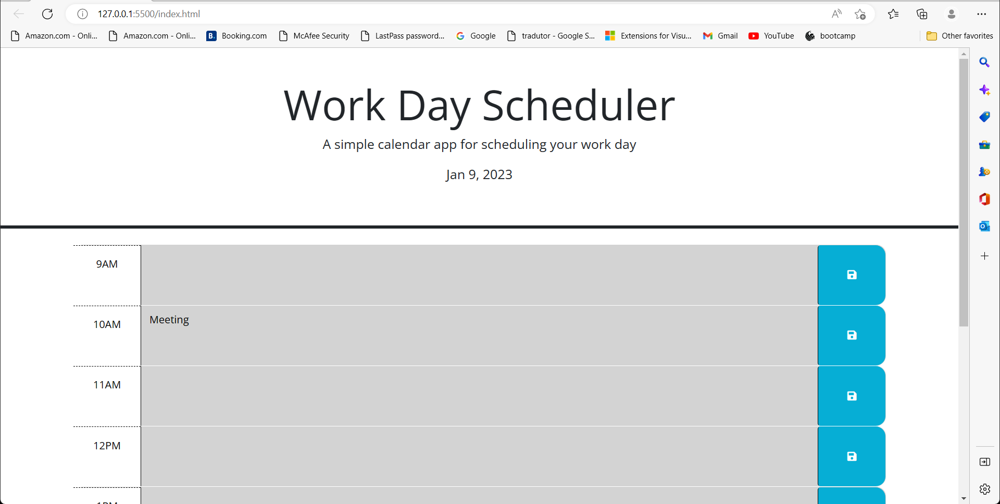
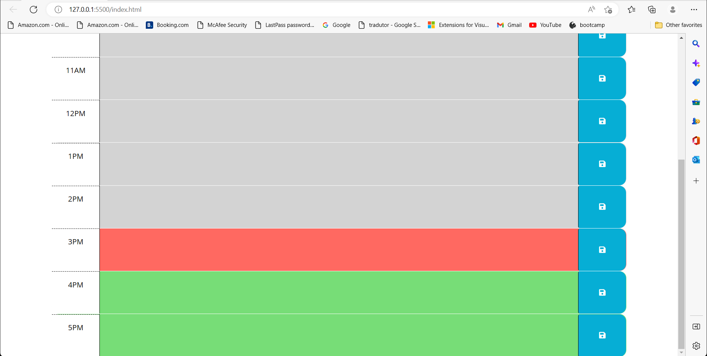

# My-Day-Scheduler

The task on this challenge was to create a Day Schedule that would display past, present and future reminders.
As part of the challenge, the user should be able to input the information on each time stol and even when the page is
refreshed all reminders are still saved. 

## Description

When user opens the page, will be able to see the current date displayed on the header.
As user scrolls down a schedule displaying business hours will , where reminders should be added and saved.
As user refreshes the page all the data previously added will still be saved.
As the time passes each event saved will show three different colors for each condition of the event: 
past = gray, present = red and future = green.

## Live Link

 https://milenasilveira.github.io/My-Day-Scheduler/

## Screenshots

## Versioning

GitHub is hosting this project and it is used for version control.

## Credits

UCF Coding Bootcamp.